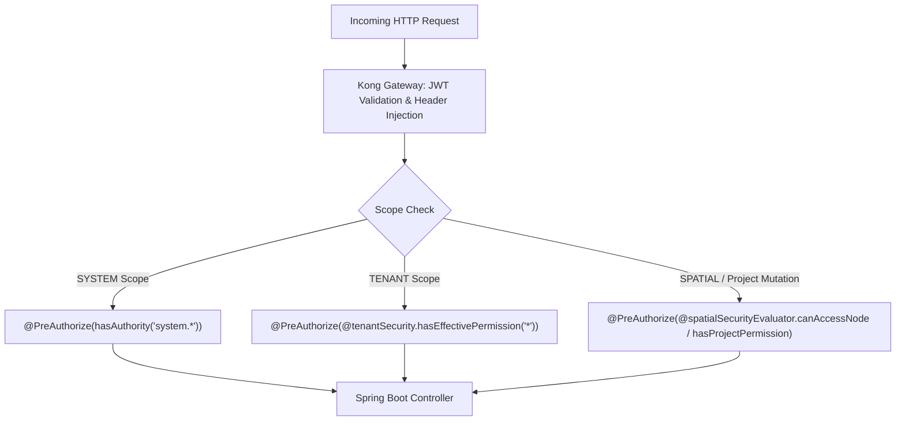

# Standar Baku Pembuatan Modul Baru (Enterprise Module Development SOP)

Dokumen ini adalah pedoman arsitektur dan standar kepatuhan keamanan wajib (*mandatory security & architectural standard*) dalam pembuatan modul baru di seluruh ekosistem K2NET FTTH GIS:
1. **Backend Core API (Spring Boot 3.x)**
2. **Frontend System Admin Portal (`apps/studio-admin`)**
3. **Frontend Tenant Portal (`apps/studio-tenant`)**
4. **Go Microservices & Gateways (`services/*`)**

---

## 🏛️ 1. Filosofi Otorisasi: Modern PBAC & Spatial ABAC

K2NET mengadopsi standar otorisasi 3-Lapis: **Modern PBAC (Permission-Based Access Control)** dan **Spatial ABAC (Attribute-Based Access Control)**:



### Prinsip Pokok:
1. **Role hanyalah wadah (*container*) izin**: Nama role (`super_admin`, `admin`, `supervisor`, `technician`) bebas dikonfigurasi di database tanpa perlu mengubah kode sumber.
2. **Kode aplikasi hanya menguji Permission atomik**: Seluruh controller, route guard, dan tombol UI menguji kode permission (`system.users.view`, `system.gateway.manage`, `network.manage`, `ticket.create`), **bukan** nama role.
3. **Spatial ABAC untuk Mutasi Proyek**: Seluruh operasi yang memutasi resource terikat proyek (`network_nodes`, `fiber_cables`, `customers`, `splitter_ports`, `fiber_cores`) **wajib** divalidasi via `SpatialSecurityEvaluator` (`canAccessNode`, `canAccessCable`, `hasProjectPermission`).
4. **Dilarang Keras `isAuthenticated()` Polos**: Tidak ada endpoint bisnis yang boleh dirilis hanya dengan `@PreAuthorize("isAuthenticated()")` atau tanpa anotasi otorisasi. Seluruh endpoint wajib memiliki permission eksplisit.

---

## 🚀 2. Alur 6-Langkah Pembuatan Modul Baru (Definition of Done Wajib)

Setiap kali Agent atau Developer membuat, memodifikasi, atau menyarankan controller/endpoint baru, **WAJIB** mengikuti checklist 6-Langkah ini sebagai *Definition of Done*:

### 🔹 Langkah 1: Migrasi Database Permission (Flyway SQL)
Setiap modul baru **wajib** mendaftarkan permission atomiknya ke database melalui file migrasi Flyway di `apps/api/src/main/resources/db/migration/V{N}__add_{module}_permissions.sql`.
Migration wajib melakukan:
1. `INSERT INTO permissions ...`
2. `INSERT INTO role_permissions ...` mapping ke role relevan dalam migrasi yang **SAMA**.

```sql
-- 1. Daftarkan Permissions Atomik Modul Baru
INSERT INTO permissions (code, name, description, module, scope, created_at, updated_at)
VALUES 
  ('system.inventory.view', 'View Inventory', 'Melihat daftar inventaris perangkat', 'inventory', 'SYSTEM', NOW(), NOW()),
  ('system.inventory.manage', 'Manage Inventory', 'Membuat, mengubah, dan menghapus inventaris', 'inventory', 'SYSTEM', NOW(), NOW())
ON CONFLICT (code) DO UPDATE SET 
  name = EXCLUDED.name, 
  description = EXCLUDED.description, 
  module = EXCLUDED.module,
  scope = EXCLUDED.scope,
  updated_at = NOW();

-- 2. Asosiasikan ke Role Default dalam migration yang SAMA
INSERT INTO role_permissions (role_id, permission_id)
SELECT r.id, p.id 
FROM roles r, permissions p 
WHERE r.name = 'super_admin' AND r.is_system_role = true
  AND p.code IN ('system.inventory.view', 'system.inventory.manage')
ON CONFLICT DO NOTHING;
```

---

### 🔹 Langkah 2: Proteksi Backend Controller (Spring Boot)
Di layer Java Controller ([apps/api](file:///opt/project5/apps/api)), lindungi method REST API menggunakan `@PreAuthorize`:

```java
@RestController
@RequestMapping("/api/v1/network/devices")
@RequiredArgsConstructor
@Slf4j
public class DeviceManagementController {

    private final DeviceService deviceService;

    // Endpoint Baca (Read-Only)
    @GetMapping
    @PreAuthorize("hasAuthority('network.view')")
    public ResponseEntity<List<DeviceDto>> getAll() {
        return ResponseEntity.ok(deviceService.findAll());
    }

    // Endpoint Mutasi Terikat Project (Spatial ABAC)
    @PostMapping
    @PreAuthorize("@spatialSecurityEvaluator.hasProjectPermission(#dto.projectId, 'network.manage')")
    @AuditRequired(action = "DEVICE_CREATED", resourceType = "DEVICE", resourceIdExpression = "#result.body.id")
    public ResponseEntity<DeviceDto> create(@Valid @RequestBody DeviceDto dto) {
        return ResponseEntity.status(HttpStatus.CREATED).body(deviceService.create(dto));
    }

    // Endpoint Mutasi Berdasarkan Node ID
    @PutMapping("/{id}")
    @PreAuthorize("@spatialSecurityEvaluator.canAccessNode(#id, 'network.manage')")
    public ResponseEntity<DeviceDto> update(@PathVariable UUID id, @RequestBody DeviceDto dto) {
        return ResponseEntity.ok(deviceService.update(id, dto));
    }
}
```

---

### 🔹 Langkah 3: Integrasi Navigasi Sidebar Frontend
Daftarkan metadata rute baru ke dalam konfigurasi navigasi di `apps/studio-admin/src/config/system-sidebar-navigation.ts`:

```typescript
export const SYSTEM_SIDEBAR_NAVIGATION: SystemNavSection[] = [
  {
    title: "OPERATIONS",
    items: [
      {
        title: "Perangkat & Inventaris",
        href: "/inventory",
        icon: Boxes,
        permission: "system.inventory.view", // <-- Filter otomatis berbasis permission
        description: "Manajemen hardware OLT, ODP, dan aset fisik"
      }
    ]
  }
];
```

---

### 🔹 Langkah 4: Registrasi Halaman & Granular UI Guard
Bungkus halaman dan tombol aksi mutasi data sensitif dengan `PermissionGuard`:

```tsx
import { PageLayout } from "@k2net/ui";
import { PermissionGuard, usePermissions } from "@/hooks/use-permissions";
import { Button } from "@k2net/ui";

export default function DevicePage() {
  const { canAccess } = usePermissions();

  return (
    <PageLayout variant="dashboard" title="Manajemen Perangkat" description="Inventaris aset perangkat FTTH">
      <PermissionGuard permission="network.view" fallback={<AccessDeniedCard />}>
        <div className="flex justify-between mb-4">
          <h2>Daftar Perangkat</h2>
          <PermissionGuard permission="network.manage">
            <Button onClick={handleCreate} className="bg-primary text-primary-foreground">
              + Tambah Perangkat
            </Button>
          </PermissionGuard>
        </div>
        <DeviceTable />
      </PermissionGuard>
    </PageLayout>
  );
}
```

---

### 🔹 Langkah 5: Menjalankan CI Security Coverage Gate Test
Setiap perubahan controller **wajib** lolos test reflection otomatis `ComprehensiveControllerSecurityCoverageTest`.
Build akan otomatis gagal jika ada endpoint tanpa `@PreAuthorize` atau menggunakan anti-pattern.

```bash
mvn test -Dtest=ComprehensiveControllerSecurityCoverageTest -f apps/api/pom.xml
```

---

### 🔹 Langkah 6: Audit Live Database & Uji Runtime HTTP Nyata
Sebelum menyatakan pekerjaan selesai:
1. **Jalankan Audit Matrix Live**: `bash scripts/audit-security-matrix.sh` (atau `pnpm audit:security`). Lampirkan output query mentah database (roles, permissions, role_permissions).
2. **Uji Runtime HTTP**: Jalankan minimal 1 pengujian runtime HTTP nyata (misal via `scripts/verify-fase3-abac.sh` atau curl) yang membuktikan:
   - Role/token **tanpa permission** $\rightarrow$ `HTTP 403 Forbidden`
   - Role/token **dengan permission sah** $\rightarrow$ `HTTP 200 OK`

---

## 🚫 3. Daftar Larangan Mutlak (Strict Anti-Patterns)

| Kategori | ❌ TERLARANG (Anti-Pattern) | ✅ WAJIB (Standar Baru) |
|---|---|---|
| **Spring Controller** | `@PreAuthorize("isAuthenticated()")` untuk data operasional | `@PreAuthorize("hasAuthority('...')")` atau `@PreAuthorize("@tenantSecurity.hasEffectivePermission('...')")` |
| **Spring Role Check** | `@PreAuthorize("hasRole('ROLE_SUPER_ADMIN') or hasRole('authenticated')")` | Granular PBAC `hasAuthority(...)` |
| **Mutasi Spasial** | `hasAuthority('network.manage')` polos tanpa validasi project ID | `@PreAuthorize("@spatialSecurityEvaluator.hasProjectPermission(#dto.projectId, 'network.manage')")` atau `canAccessNode` |
| **Migrasi Permission** | Menambahkan permission tanpa langsung memetakan ke role di migration yang sama | `INSERT INTO role_permissions ...` dalam file SQL Flyway yang sama |
| **Frontend Roles** | `roles.includes("ROLE_SUPER_ADMIN")` | `usePermissions().isSuperAdmin` atau `canAccess("...")` |
| **Frontend Styling** | Hardcode warna: `bg-zinc-900`, `text-white`, `bg-emerald-500` | Token Semantik: `bg-card`, `text-foreground`, `bg-primary`, `border-border` |
| **Deployment** | Menjalankan `docker build` atau `docker compose build` di server | Git push ke `main` (build oleh GitHub Actions Runner) |

---

## 🧪 4. Perintah Verifikasi Mandiri Pre-Deployment

```bash
# 1. Verifikasi Keamanan PBAC & Endpoint Coverage (Wajib 100%)
pnpm audit:security

# 2. Verifikasi Frontend Admin (Audit Warna + TypeScript + 67 Rute)
pnpm verify:admin

# 3. Verifikasi Backend Java (Kompilasi Maven + CI Coverage Gate)
pnpm verify:backend

# 4. Verifikasi Seluruh 13 Microservices Go & Gateways
pnpm verify:gateways

# 5. Full Pre-Deployment Verification (Seluruh Pilar)
pnpm verify
```
