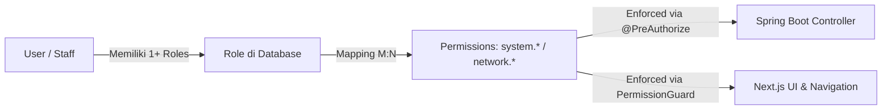

# Standar Baku Pembuatan Modul Baru (Enterprise Module Development SOP)

Dokumen ini adalah pedoman arsitektur dan standar kepatuhan keamanan wajib (*mandatory security & architectural standard*) dalam pembuatan modul baru di seluruh ekosistem K2NET FTTH GIS:
1. **Backend Core API (Spring Boot 3.x)**
2. **Frontend System Admin Portal (`apps/studio-admin`)**
3. **Frontend Tenant Portal (`apps/studio-tenant`)**
4. **Go Microservices & Gateways (`services/*`)**

---

## 🏛️ 1. Filosofi Otorisasi: PBAC (Permission-Based Access Control)

K2NET telah mengadopsi standar modern **PBAC (Permission-Based Access Control)** yang menggantikan sistem legacy RBAC kaku.



### Prinsip Pokok:
1. **Role hanyalah wadah (*container*) izin**: Nama role (`super_admin`, `admin`, `noc_tier_2`) bebas dikustomisasi di database tanpa perlu mengubah kode sumber.
2. **Kode aplikasi hanya menguji Permission atomik**: Seluruh controller, route guard, dan tombol UI menguji kode permission (`system.users.view`, `system.gateway.manage`, `network.node.create`), **bukan** nama role.
3. **Pengecualian Tunggal**: Role `super_admin` hanya difungsikan sebagai *Platform God-Mode Emergency Bypass* di layer paling luar, bukan untuk pengecekan bisnis per fitur.

---

## 🚀 2. Alur 5-Langkah Pembuatan Modul Baru (End-to-End SOP)

Saat membuat modul baru (misal modul *"Inventory Spasial"*, *"Billing Core"*, atau *"AI Agent Optimizer"*), ikuti 5 langkah berurutan ini:

### 🔹 Langkah 1: Migrasi Database Permission (Flyway SQL)
Setiap modul baru **wajib** mendaftarkan permission atomiknya ke database melalui file migrasi Flyway di `apps/api/src/main/resources/db/migration/V{N}__add_{module}_permissions.sql`.

```sql
-- 1. Daftarkan Permissions Atomik Modul Baru
INSERT INTO permissions (code, name, description, module, scope, created_at, updated_at)
VALUES 
  ('system.inventory.view', 'View Inventory', 'Melihat daftar inventaris perangkat', 'inventory', 'SYSTEM', NOW(), NOW()),
  ('system.inventory.manage', 'Manage Inventory', 'Membuat, mengubah, dan menghapus inventaris', 'inventory', 'SYSTEM', NOW(), NOW())
ON CONFLICT (code) DO UPDATE SET 
  name = EXCLUDED.name, 
  description = EXCLUDED.description, 
  module = EXCLUDED.module,
  scope = EXCLUDED.scope,
  updated_at = NOW();

-- 2. Asosiasikan ke Role Default (misal SUPER_ADMIN atau SYSTEM_ADMIN)
INSERT INTO role_permissions (role_id, permission_id)
SELECT r.id, p.id 
FROM roles r, permissions p 
WHERE r.name = 'super_admin' AND r.is_system_role = true
  AND p.code IN ('system.inventory.view', 'system.inventory.manage')
ON CONFLICT DO NOTHING;
```

---

### 🔹 Langkah 2: Proteksi Backend Controller (Spring Boot)
Di layer Java Controller ([apps/api](file:///opt/project5/apps/api)), lindungi method REST API menggunakan `@PreAuthorize` berbasis `hasAuthority`:

```java
@RestController
@RequestMapping("/api/v1/system/inventory")
@RequiredArgsConstructor
@Slf4j
public class SystemInventoryController {

    private final InventoryService inventoryService;

    // Endpoint Baca (Read-Only)
    @GetMapping
    @PreAuthorize("hasAuthority('system.inventory.view')")
    public ResponseEntity<List<InventoryDto>> getAll() {
        return ResponseEntity.ok(inventoryService.findAll());
    }

    // Endpoint Mutasi (Create/Update/Delete) + Audit Logging
    @PostMapping
    @PreAuthorize("hasAuthority('system.inventory.manage')")
    @AuditRequired(action = "INVENTORY_CREATED", resourceType = "INVENTORY", resourceIdExpression = "#result.body.id")
    public ResponseEntity<InventoryDto> create(@Valid @RequestBody CreateInventoryRequest request) {
        return ResponseEntity.status(HttpStatus.CREATED).body(inventoryService.create(request));
    }
}
```

*Catatan Backend:*
- **Larangan Hardcode Variant**: Dilarang menulis `@PreAuthorize("hasRole('ROLE_SUPER_ADMIN') or ...")`. Sistem Ingress `SecurityConfig.java` telah otomatis menormalkan token Keycloak ke format kanonikal `ROLE_<clean_role>` dan meng-inject permissions dari DB.
- **Auto-Eviction Cache L2**: `PermissionSeeder.java` otomatis membersihkan Hibernate L2 cache (`Role` & `Permission`) pada startup agar perubahan permission langsung aktif tanpa restart DB.

---

### 🔹 Langkah 3: Integrasi Navigasi Sidebar Frontend
Daftarkan metadata rute baru ke dalam konfigurasi navigasi di `apps/studio-admin/src/config/system-sidebar-navigation.ts`:

```typescript
export const SYSTEM_SIDEBAR_NAVIGATION: SystemNavSection[] = [
  // ...
  {
    title: "OPERATIONS",
    items: [
      {
        title: "Perangkat & Inventaris",
        href: "/inventory",
        icon: Boxes,
        permission: "system.inventory.view", // <-- Filter otomatis berbasis permission
        description: "Manajemen hardware OLT, ODP, dan aset fisik"
      }
    ]
  }
];
```
*Sidebar Navigation (`admin-sidebar.tsx` & `system-secondary-sidebar.tsx`) akan secara otomatis menyembunyikan menu tersebut jika user tidak memiliki permission `system.inventory.view`.*

---

### 🔹 Langkah 4: Registrasi Halaman & TanStack Router
1. **Buat Halaman**: `apps/studio-admin/src/app/(dashboard)/inventory/page.tsx`
2. **Daftarkan Rute**: Di `apps/studio-admin/src/router.tsx`:
```typescript
const inventoryRoute = createRoute({
  getParentRoute: () => authenticatedLayoutRoute,
  path: "/inventory",
  component: () => <Lazy><InventoryPage /></Lazy>,
});
```
3. **Gunakan Page Layout Baku**:
```tsx
import { PageLayout } from "@k2net/ui";
import { PermissionGuard } from "@/hooks/use-permissions";

export default function InventoryPage() {
  return (
    <PageLayout variant="dashboard" title="Inventaris Perangkat" description="Manajemen aset fisik dan hardware">
      <PermissionGuard permission="system.inventory.view" fallback={<AccessDeniedCard />}>
        <InventoryTable />
      </PermissionGuard>
    </PageLayout>
  );
}
```

---

### 🔹 Langkah 5: Proteksi Tombol Aksi Sensitif (Granular UI Guard)
Untuk tombol-tombol mutasi data (Tambah, Edit, Hapus, Sync, Reset):

```tsx
import { PermissionGuard, usePermissions } from "@/hooks/use-permissions";
import { Button } from "@k2net/ui";

export function InventoryActionToolbar() {
  const { canAccess } = usePermissions();

  return (
    <div className="flex items-center gap-2">
      {/* Tombol hanya muncul jika memiliki izin manage */}
      <PermissionGuard permission="system.inventory.manage">
        <Button onClick={handleCreate} className="bg-primary text-primary-foreground">
          + Tambah Perangkat
        </Button>
      </PermissionGuard>

      {/* Atau gunakan pengecekan imperatif */}
      <Button 
        variant="destructive" 
        disabled={!canAccess("system.inventory.manage")}
        onClick={handleDelete}
      >
        Hapus Terpilih
      </Button>
    </div>
  );
}
```

---

## 🚫 3. Daftar Larangan Mutlak (Strict Anti-Patterns)

| Kategori | ❌ TERLARANG (Anti-Pattern) | ✅ WAJIB (Standar Baru) |
|---|---|---|
| **Spring Controller** | `@PreAuthorize("hasRole('ROLE_SUPER_ADMIN') or hasRole('super_admin')")` | `@PreAuthorize("hasAuthority('system.<modul>.<aksi>')")` |
| **Spring Role Check** | `@PreAuthorize("hasRole('authenticated')")` | `@PreAuthorize("hasAuthority('...')")` atau role eksplisit berizin |
| **Frontend Roles** | `roles.includes("ROLE_SUPER_ADMIN") || roles.includes("super_admin")` | `usePermissions().isSuperAdmin` atau `canAccess("system.<modul>.<aksi>")` |
| **Frontend Styling** | Hardcode warna: `bg-zinc-900`, `text-white`, `bg-emerald-500` | Token Semantik: `bg-card`, `text-foreground`, `bg-primary`, `border-border` |
| **UI Primitives** | Copy-paste file komponen Shadcn ke `src/components/ui/` | Import dari `@k2net/ui` (`packages/ui`) |
| **Microservices Scope** | Query DB langsung tanpa membaca header `X-Tenant-ID` | Scope seluruh operasi DB/Redis/S3 berdasarkan `X-Tenant-ID` |
| **Deployment** | Menjalankan `docker build` atau `docker compose build` di server | Push commit ke branch `main` (build dijalankan oleh GitHub Actions) |

---

## 🧪 4. Checklist Verifikasi Mandiri Sebelum Commit

Sebelum melakukan `git commit` dan `git push`, wajib lolos 3 pengujian:

```bash
# 1. Verifikasi Frontend Admin (Audit Warna + TypeScript + 67 Rute)
pnpm verify:admin

# 2. Verifikasi Backend Java (Kompilasi Maven)
mvn test-compile -DskipTests=true -f apps/api/pom.xml

# 3. Verifikasi Seluruh 13 Microservices Go
pnpm verify:gateways
```
